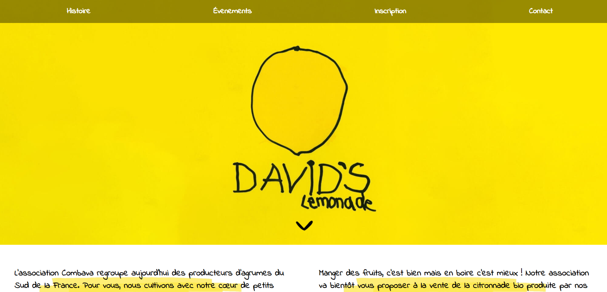
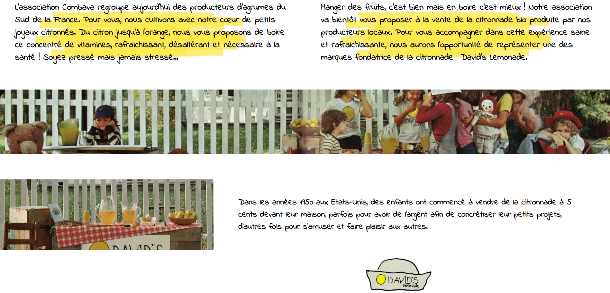
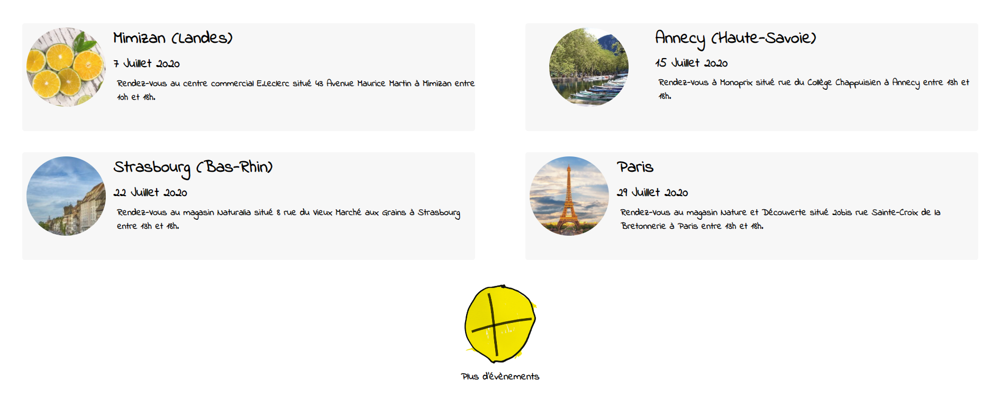
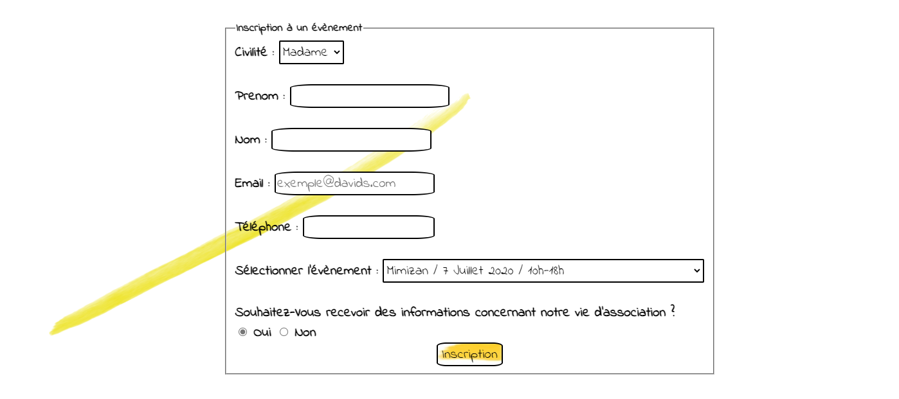

# Site vitrine Combava 
Réalisé en collaboration avec [Antoine Droual](https://github.com/Anmaceis) et [Florian Toribio](https://github.com/sepios87) lors du second semestre de DUT Informatique.
## Présentation
Nous devions élaborer un site Web fictif, one-page vitrine pour l'association Combava, producteurs d'agrumes dans le Sud de la France. 
Cette association a eu l'opportunité d'utiliser une des marques emblématiques et fondatrices de citronnade aux Etats-Unis : Davids Lemonade pour produire et commercialiser ses produits. 
Combava souhaite faire connaitre ses produits dans la France entière grâce à la présentation et la vente de ses produits sur une dizaines de lieux et de dates.  
Nous devions donc créer ce site en présentant l'association, la marque et en présentant les différentes dates de présentation des produits en France ainsi que de faire un formulaire permettant aux personnes intéressées de s'inscrire sur une date.

## Détails du projet 
Nous avons décidé de partager le site en 4 parties : 
- Histoire
- Evènements
- Inscription
- Contact

Ces 4 parties ont formé notre menu. 

### Histoire 
Cette partie est consacrée à l'histoire de Davids Lemonade. Il était important de rappeler ce qu'était Davids Lemonade pour expliquer pourquoi notre client commercialise ses produits sous leur nom. C'est pourquoi des photographies de l'époque ont été intégrés à notre site Web pour montrer l'engouement qui existait autour de cette marque.

Nous avons aussi mis en lumière l'association Combava en dévoilant leur futur projet : faire déguster leur produit dans la France entière à travers des stands de dégustations.

### Evènements 
Combava nous avait communiqué une liste de 10 évènements dans la France entière sur les mois de Juillet et Août 2020. 
L'utilisateur pouvait alors découvrir les dégustations proches de chez lui grâce à une carte Google Map. 

### Inscription
Afin que Combava puisse prévoir le nombre de personnes qui étaient intéressés par un événement, un formulaire était à disposition des utilisateurs afin de s'inscrire.    

### Contact
Pour terminer cette réalisation one-page, il est important de laisser les coordonnées de l'association en bas de la page. Aujourd'hui la présence sur les réseaux sociaux est importante, elle influe sur la visibilité de la marque. C'est pour cela que les liens de tous leurs moyens de contact sont disponibles en bas de la page.

## Outils & langages

#### Projet développé en : 
- HTML 
- CSS

#### Avec : 
- Atom 
